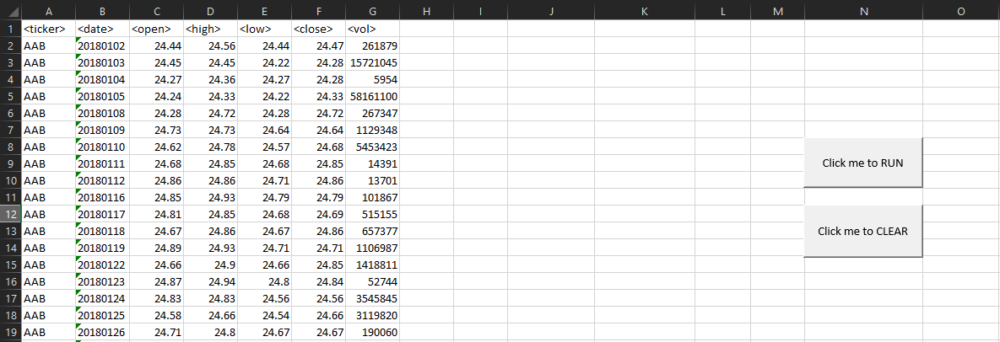
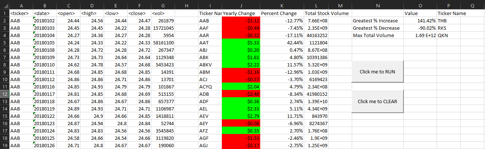
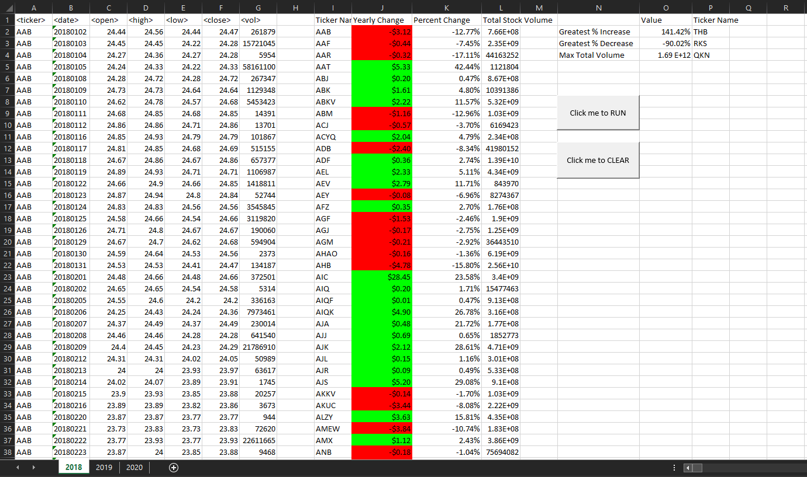
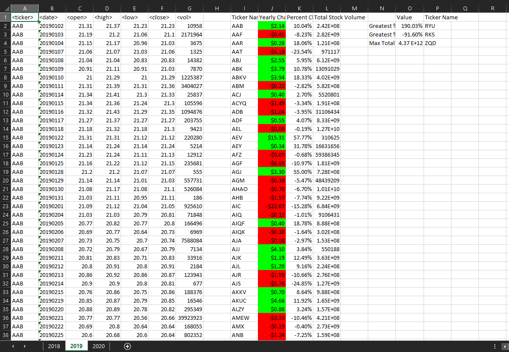
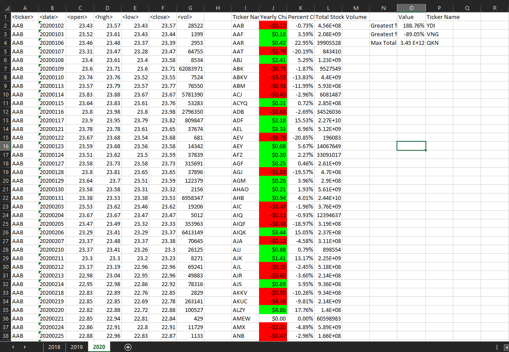

# Visual Basics and Excel: Stock Market Analysis 2018 - 2020

## Context:

    Welcome all viewers! In this assignment is a demonstration of skills of what I have learned in Visual Basics using Excel. With one click of a button, you can either clear your worksheet or generate a summary table that analyzes the given stock market data. 

## Files:

* [Images] - Folder containing screen shots of what 'Stock_Data 2018 - 2020.xlsm' will look like before and after utilizing the buttons. This folder also contains screenshots of the results for each year of the database from 2018 to 2020.

* [Resources] - Folder contains the exported VB scripts used to loop and calculate the database along with  the 'Stock_Data 2018 - 2020.xlsm'

## Instructions:

1. Open file under [Resources](Resources/Stock_Data 2018 - 2020.xlsm): 
    
    

* Upon opening 'Stock_Data 2018 - 2020.xlsm' , you will see all of the data of the stock market for each year from 2018 to 2020. 

    * There are two buttons:
        * [RUN](Resources/stock_data_v1_3.vbs) This script is assigned to a button named, "Click me to RUN". It's function is to loop through all worksheets analyzing and creating a summary table of the database. 
        * [CLEAR](Resources/clear_page.vbs) This script is assigned to a button named, "Click me to CLEAR". This script's function will loop through each worksheet clearing out all calculations.

2. Click on "Click me to Run" first to run script

3. Click on "Click me to CLEAR" if you want to see numbers disappear suddenly. 

**Note:** Enable macros when you open 'Stock_Data 2018 - 2020.xlsm'. Calculations after clicking the 'Run' button may take a few minutes to process the script.

## Summary and Analysis:

For this assignment, I created a VB script that loops through all the worksheets in 'Stock_Data 2018 - 2020.xlsm' and outputs the following in a summary table:

* Ticker symbol (Column "I") - Lists a name per row as the loop loops through the worksheets

* Yearly change (Column "J") - These values are calculated by finding the difference of the first opening price and the last closing price. Green highlights are all positive increases from the first opening price. All red highlights show all negative decreases. All values that have $0.00 increase/decrease are left blank.

* Percent change (Column "K") - These values are calculated after finding the difference of yearly change and dividing it by the first opening price. 

* Total stock volume (Column "L") - Values in this column are calculated by adding up all increments per ticker in Column "G".

* Bonus! To challenge myself more, I added a seperate summary table that includes some additional statistical analysis. 
    * Columns "N:P" displays the values for the Greatest % Increase, Greatest % Decrease, and the Greatest total volume per sheet. 

* Screen shots of results for each year:

